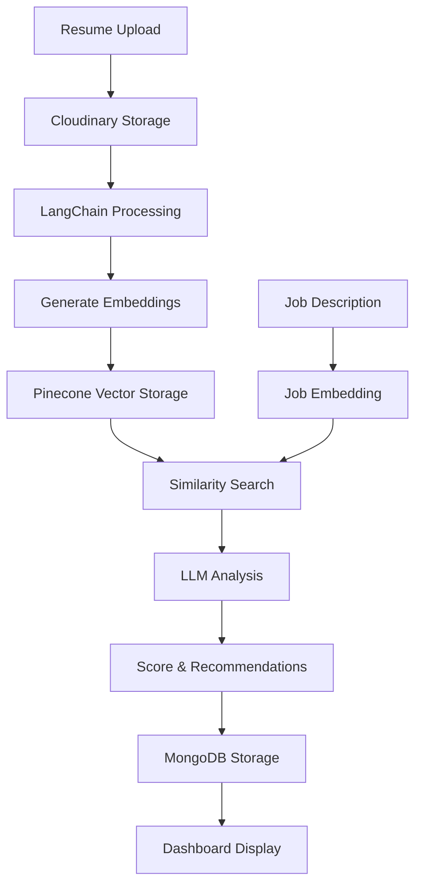

# CVision - AI Resume Analyzer Platform

[](https://youtu.be/g1Y-4byQIcc)

CVision is a resume analysis platform that uses AI to help match candidates with job requirements. Built with LangChain, Groq APIs, and Pinecone vector search, it provides resume analysis and job matching capabilities for both job seekers and recruiters.


---

## Features

### For Recruiters
- Upload and parse resumes automatically
- Rank candidates based on job description matching
- Get AI-generated fit scores and candidate analysis
- Compare candidate profiles
- Download resumes directly from the platform

### For Job Seekers
- Upload resume for AI analysis
- Receive feedback on ATS compatibility
- Get skill gap analysis based on job market data
- Receive improvement suggestions for your resume

---

## Tech Stack

| Component | Technology |
|-----------|------------|
| Frontend | Flask |
| AI Processing | LangChain + Groq LLM |
| Vector Search | Pinecone |
| File Storage | Cloudinary |
| Database | MongoDB |

---

## System Architecture



---

## Getting Started

### Prerequisites
- Python 3.9+
- Groq API key
- Pinecone account and index
- MongoDB database
- Cloudinary account

### Installation

1. **Clone the repository**
   ```bash
   git clone https://github.com/sameeran4218/CVision.git
   cd CVision
   ```

2. **Create virtual environment**
   ```bash
   python -m venv venv
   source venv/bin/activate   # Windows: venv\Scripts\activate
   ```

3. **Install dependencies**
   ```bash
   pip install -r requirements.txt
   ```

4. **Configure environment variables**
   Create a `.env` file with:
   ```
   GROQ_API_KEY=your_groq_api_key
   PINECONE_API_KEY=your_pinecone_key
   PINECONE_INDEX_NAME=your_index_name
   MONGODB_URI=your_mongodb_connection_string
   CLOUDINARY_CLOUD_NAME=your_cloud_name
   CLOUDINARY_API_KEY=your_api_key
   CLOUDINARY_API_SECRET=your_api_secret
   ```

### Running the Application
```bash
python app.py
```

---

## How It Works

### Candidate Workflow
1. Upload resume (PDF/Word format)
2. System extracts and analyzes resume content
3. Compares against job descriptions in database
4. Provides personalized improvement recommendations

### Recruiter Workflow
1. Post job description
2. System matches uploaded resumes against job requirements
3. Candidates are ranked by compatibility score
4. View detailed analysis of each candidate's strengths and gaps

---

## Project Status

This is a demonstration project showcasing AI-powered resume analysis capabilities. The platform provides basic matching and analysis features using modern AI tools and vector search technology.
