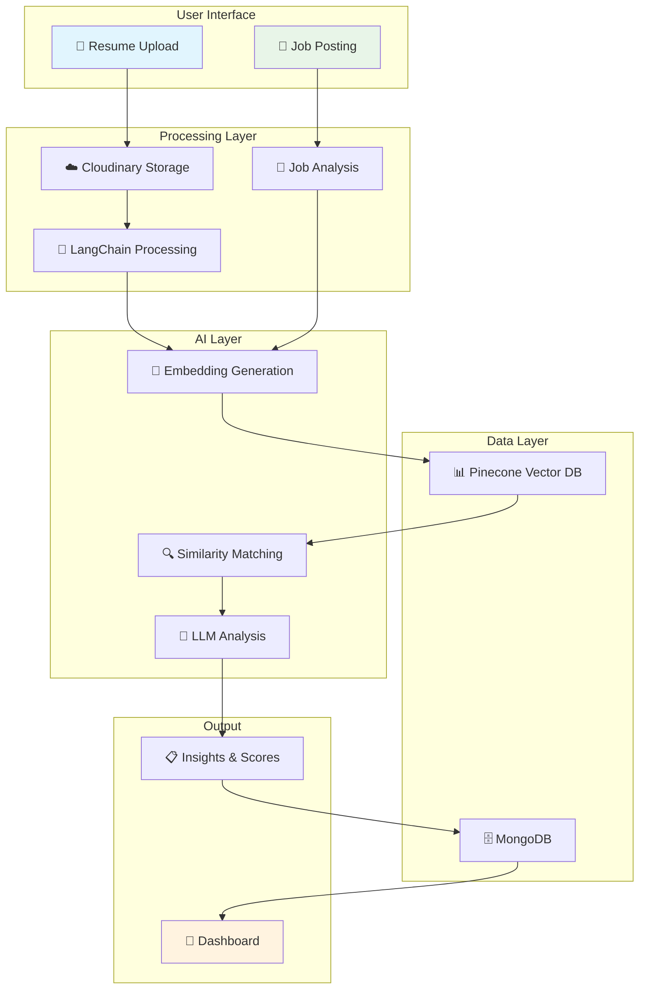
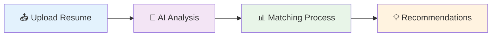
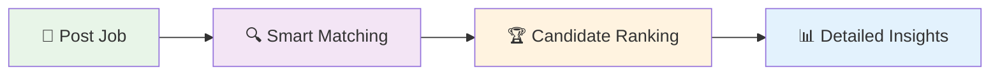

# 🎯 CVision - AI Resume Analyzer Platform

<div align="center">

[](https://youtu.be/g1Y-4byQIcc)
[]()
[]()
[]()

*An intelligent resume analysis platform powered by AI that bridges the gap between candidates and opportunities*

</div>


---

## ✨ What is CVision?

CVision transforms the traditional resume screening process using artificial intelligence. By leveraging LangChain, Groq APIs, and Pinecone vector search, it creates intelligent connections between resumes and job requirements, helping both job seekers and recruiters make better decisions.

---

## 🚀 Features

<table>
<tr>
<td width="50%">

### 👔 **For Recruiters**
- 📤 **Smart Resume Parsing** - Automatic extraction and analysis
- 🏆 **Intelligent Ranking** - AI-powered candidate scoring
- 📊 **Detailed Analytics** - Comprehensive fit analysis
- ⚖️ **Side-by-Side Comparison** - Compare multiple candidates
- 📥 **Easy Downloads** - Direct resume access

</td>
<td width="50%">

### 🎓 **For Job Seekers**
- 📋 **Resume Analysis** - AI-powered feedback system
- 🤖 **ATS Compatibility** - Optimize for applicant tracking systems
- 🎯 **Skill Gap Analysis** - Identify improvement areas
- 💡 **Smart Suggestions** - Tailored enhancement recommendations
- 📈 **Market Insights** - Data-driven career guidance

</td>
</tr>
</table>

---

## 🛠️ Tech Stack

<div align="center">

| **Category** | **Technology** | **Purpose** |
|:------------:|:--------------:|:-----------:|
| 🎨 **Frontend** | Flask | Web application framework |
| 🤖 **AI Engine** | LangChain + Groq | Natural language processing |
| 🔍 **Search** | Pinecone | Vector similarity matching |
| ☁️ **Storage** | Cloudinary | File management |
| 🗄️ **Database** | MongoDB | Data persistence |

</div>

---

## 🏗️ System Architecture



---

## 🚀 Quick Start

### 📋 Prerequisites

```bash
✅ Python 3.9+
✅ Groq API key
✅ Pinecone account
✅ MongoDB database
✅ Cloudinary account
```

### 💾 Installation

<details>
<summary><b>🔽 Step-by-step installation guide</b></summary>

#### 1️⃣ **Clone Repository**
```bash
git clone https://github.com/sameeran4218/CVision.git
cd CVision
```

#### 2️⃣ **Setup Environment**
```bash
# Create virtual environment
python -m venv venv

# Activate environment
source venv/bin/activate  # Linux/Mac
# OR
venv\Scripts\activate     # Windows
```

#### 3️⃣ **Install Dependencies**
```bash
pip install -r requirements.txt
```

#### 4️⃣ **Configure Environment**
Create `.env` file:
```env
# AI Configuration
GROQ_API_KEY=your_groq_api_key

# Vector Database
PINECONE_API_KEY=your_pinecone_key
PINECONE_INDEX_NAME=your_index_name

# Database
MONGODB_URI=your_mongodb_connection_string

# File Storage
CLOUDINARY_CLOUD_NAME=your_cloud_name
CLOUDINARY_API_KEY=your_api_key
CLOUDINARY_API_SECRET=your_api_secret
```

</details>

### 🎬 **Launch Application**
```bash
python app.py
```

🌐 **Access at:** `http://localhost:5000`

---

## 🔄 How It Works

<div align="center">

### 👤 **Candidate Journey**



</div>

1. **📤 Upload Resume** - Support for PDF/Word formats
2. **🔍 Content Analysis** - AI extracts and understands resume content
3. **🎯 Job Matching** - Compares against relevant job descriptions
4. **📋 Personalized Report** - Detailed feedback and improvement suggestions

---

<div align="center">

### 🏢 **Recruiter Workflow**



</div>

1. **📝 Job Posting** - Input detailed job requirements
2. **🤖 AI Matching** - System analyzes all uploaded resumes
3. **🏆 Smart Ranking** - Candidates sorted by compatibility score
4. **📊 Comprehensive Analysis** - Detailed strengths and gap analysis

---

## 📊 Project Status

<div align="center">

| Status | Description |
|:------:|:------------|
| 🚧 | **In Development** - Core features implemented |
| 🧪 | **Demo Ready** - Functional prototype available |
| 🎯 | **Learning Project** - Showcases AI integration capabilities |

</div>

---

<div align="center">

### 🌟 **Built with passion for connecting talent with opportunity**

---

*Made with ❤️ using modern AI technologies*

</div>
