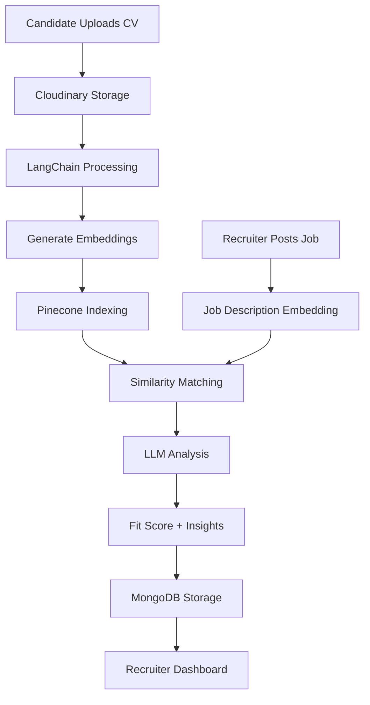

# 🔍 CVision - AI Powered Resume Analyzer Platform

[](https://youtu.be/g1Y-4byQIcc)

CVision revolutionizes hiring with LLM powered cv analysis via Langchain which allows recruiters to get smart insights into candidate's resume and and cut down time.


---

## 🌟 Key Features

### For Job Seekers
- **AI Resume Report Card** - Scores your resume on ATS compatibility
- **Skill Gap Analysis** - Identifies missing skills for target roles
- **Personalized Suggestions** - Actionable improvement tips

### For Recruiters
- **Smart Candidate Ranking** - AI-driven fit scoring (1-100)
- **Comparative Analysis** - Personalized candidate evaluation based on strengths and weakness for each company and job.
- **Cloud-Based CV Parsing** - Instant insights without downloads

---

## 🛠️ Tech Stack

### Core Components
| Component | Technology |
|-----------|------------|
| Frontend |Flask|
| Resume Parser | LangChain + LLMs (Groq) |
| Vector Database | Pinecone |
| File Storage | Cloudinary |
| Database | MongoDB |

### AI Modules
- **Resume Analyzer** (LangChain + LLM (Groq))
- **Job-CV Matcher** (Pinecone similarity search)
- **Suggestion Generator** (LangChain + LLM (Groq))

---

## 🏗️ System Architecture


---

## 🚀 Getting Started

### Prerequisites
- Python 3.9+
- Groq API key
- Pinecone Index
- Mongo DB collection
- Cloudinary Api key

### Installation

1. **Clone the repository**
   ```bash
   git clone https://github.com/sameeran4218/CVision.git
   cd cvision
   ```

2. **Create and activate virtual environment**
   ```bash
   python -m venv venv
   source venv/bin/activate   # On Windows use `venv\Scripts\activate`
   ```

3. **Install dependencies**
   ```bash
   pip install -r requirements.txt
   ```

4. **Set up environment variables**
   Set up your environment variables like pinecone indexes, mongodb collections, groq api key , cloudinary api key etc. in a .env folder

### Running the Application
```bash
python run app.py
```

---
## 🧠 How It Works

### 1. Candidate Flow
- Upload PDF/Word resume
- LLM analyzes resume againts similar job descriptions
- Summarizes all the suggestions for all similar job roles to give personalised recommendations to users

### 2. Recruiter Flow
- Post job with description
- LLM matches the top candidates against given job descriptions and sorts them according to their CV score,strengths and weaknesses.
- Smart insights into user cv's and easy downloadable resumes
